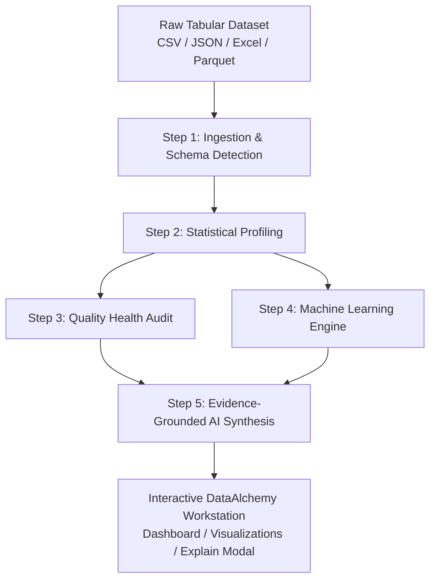

# ⚗️ DataAlchemy: Autonomous Data Intelligence Platform

> **Transform raw data into deterministic statistical truth, machine learning patterns, and evidence-grounded AI insights — in seconds.**

[](https://python.org)
[](https://fastapi.tiangolo.com)
[](https://react.dev)
[](https://www.typescriptlang.org)
[](https://vitejs.dev)
[](https://docs.pytest.org)
[](#)

---

## 📑 Table of Contents

- [The Problem Statement](#-the-problem-statement)
- [Why DataAlchemy Was Created](#-why-dataalchemy-was-created)
- [How It Makes Our Lives Easier](#-how-it-makes-our-lives-easier)
- [System Architecture](#-system-architecture)
- [Autonomous Pipeline Flow](#-autonomous-pipeline-flow)
- [Workstation Navigation & Feature Tour](#-workstation-navigation--feature-tour)
  - [1. Dataset Ingestion & Switcher (TopBar)](#1-dataset-ingestion--switcher-topbar)
  - [2. Executive Overview (`/overview`)](#2-executive-overview-overview)
  - [3. Interactive Data Explorer (`/data`)](#3-interactive-data-explorer-data)
  - [4. Data Quality Health Audit (`/quality`)](#4-data-quality-health-audit-quality)
  - [5. Statistical Intelligence Engine (`/statistics`)](#5-statistical-intelligence-engine-statistics)
  - [6. Machine Learning Intelligence (`/ml`)](#6-machine-learning-intelligence-ml)
  - [7. Evidence-Grounded AI Insights (`/insights`)](#7-evidence-grounded-ai-insights-insights)
- [Getting Started & Installation](#-getting-started--installation)
  - [Prerequisites](#prerequisites)
  - [Backend Setup (FastAPI)](#backend-setup-fastapi)
  - [Frontend Setup (React + Vite)](#frontend-setup-react--vite)
- [API Reference](#-api-reference)
- [Testing & Quality Assurance](#-testing--quality-assurance)
- [Project Directory Structure](#-project-directory-structure)

---

## 🛑 The Problem Statement

In contemporary data science, business analytics, and engineering workflows:

1. **The 80/20 Time Sink**: Data practitioners spend upwards of **70% to 80%** of their total project time on repetitive data munging, ad-hoc profiling scripts, manual summary statistics, schema checking, and outlier hunting.
2. **Brittle, Siloed Jupyter Notebooks**: Exploratory Data Analysis (EDA) is typically conducted in disposable, fragmented notebooks. These become disorganized, difficult to share with stakeholders, rarely reproducible, and prone to silent calculation errors.
3. **Static, Passive Profiling Tools**: Existing automated profilers (such as YData-Profiling or Sweetviz) generate heavy, static HTML reports. They do not allow dynamic filtering, record-level exploration, custom outlier parameter tuning, or real-time interactive query capabilities.
4. **The "Generative AI Hallucination" Trap**: Relying on generic LLM chatbots (e.g., ChatGPT, Claude) to summarize spreadsheets is hazardous:
   - LLMs frequently **hallucinate calculations**, invent non-existent trends, or confuse correlation with causation.
   - Sending proprietary enterprise datasets to cloud AI endpoints violates **data privacy, confidentiality, and GDPR/HIPAA compliance**.
   - Traditional LLMs lack mathematical certainty and cannot compute rigorous statistical tests or run machine learning algorithms on tabular tensors.

---

## 💡 Why DataAlchemy Was Created

**DataAlchemy** was engineered to solve this paradigm by bridging deterministic mathematical rigor with modern autonomous intelligence:

* **Dual-Core Analytical Philosophy**:
  * **Deterministic Core**: All metrics, schemas, correlation matrices (Pearson & Spearman), distribution parameters, quality scores, and unsupervised ML models (Isolation Forest, LOF, K-Means, DBSCAN, PCA) are computed using exact numerical algorithms via NumPy, SciPy, and Scikit-Learn.
  * **Local AI Reasoning Layer**: An open-weight Large Language Model (e.g., TinyLlama or open-weight models via Hugging Face Transformers) acts as an analytical narrator. It **only** consumes mathematically verified evidence tables emitted by the deterministic core. It **never guesses numbers** and runs entirely **locally on your machine** (Apple Silicon MPS, NVIDIA CUDA, or CPU) with zero data leaving your environment.

---

## ✨ How It Makes Our Lives Easier

| Traditional Workflow | With DataAlchemy |
| :--- | :--- |
| **Hours spent** writing boilerplate Pandas code (`df.describe()`, `df.isna()`, `df.corr()`, Matplotlib plots). | **Zero boilerplate**: Drag-and-drop or select a file; full multi-stage analysis executes autonomously in seconds. |
| **Subjective data health**: Guessing whether a dataset is clean enough for modeling or production ingestion. | **Deterministic Health Score (0–100)**: Transparent grading (Excellent, Good, Fair, Poor, Critical) with explicit penalty breakdowns across 7 audit rules. |
| **Manual outlier hunting**: Writing manual IQR or Z-score filters column by column. | **Automated Multi-Dimensional ML Outlier Detection**: Isolation Forest & LOF algorithms flag anomalies across feature combinations with ranked feature contributions. |
| **Static HTML or PDF exports**: Rigid, non-searchable reports that must be regenerated for every question. | **Interactive Workstation**: Paginated high-speed data browsing, multi-column search, column toggling, live sorting, and chart tooltips. |
| **AI Hallucinations**: Chatbots making up numbers and trend directions. | **Evidence-Grounded Explanations**: Every insight, warning, and recommendation is backed by empirical statistical evidence and audit citations. |
| **Cloud Security Risk**: Exposing company databases to third-party proprietary APIs. | **100% On-Premise & Local Execution**: Runs offline or in your private VPC with local Hugging Face model inference. |

---

## 🏛️ System Architecture

```
                               ┌─────────────────────────────────────────┐
                               │       User / Browser Workstation        │
                               │     (React 19 + TypeScript + Vite)      │
                               └────────────────────┬────────────────────┘
                                                    │ HTTP / JSON API
                                                    ▼
┌─────────────────────────────────────────────────────────────────────────────────────────────────┐
│                                   FastAPI Application Gateway                                   │
│                                           (main.py)                                             │
└───────────────────────────────────────────────────┬─────────────────────────────────────────────┘
                                                    │
                                                    ▼
┌─────────────────────────────────────────────────────────────────────────────────────────────────┐
│                                DataAlchemy Autonomous Pipeline                                  │
├─────────────────┬─────────────────┬───────────────────┬───────────────────┬─────────────────────┤
│ 1. Ingestion    │ 2. Profiling    │ 3. Quality Audit  │ 4. ML Engine      │ 5. AI Engine        │
├─────────────────┼─────────────────┼───────────────────┼───────────────────┼─────────────────────┤
│ • CSV, Parquet  │ • Semantic Types│ • Health Score    │ • Isolation Forest│ • Local HF Provider │
│ • Excel, JSON   │ • Moments (IQR, │ • 7 Audit Rules   │ • LOF Outliers    │ • Structured Context│
│ • Validations   │   Skew, Kurtosis)│ • Severity Levels │ • K-Means, DBSCAN │ • Prompt Assembly   │
│ • Schema Engine │ • Distributions │ • Recommendations │ • PCA Reduction   │ • Evidence Grounding│
└─────────────────┴─────────────────┴───────────────────┴───────────────────┴─────────────────────┘
```

---

## 🔄 Autonomous Pipeline Flow

When you select or upload a dataset, DataAlchemy coordinates a five-stage autonomous pipeline:



1. **Data Ingestion (`src/ingestion/`)**:
   - Detects file format, inspects byte integrity, detects encoding, and loads tabular structures into an immutable `Dataset` container.
   - Infer semantic data types beyond primitive dtypes: detects `numerical`, `categorical`, `datetime`, `boolean`, and `unique identifier` columns.

2. **Dataset Profiling (`src/profiling/`)**:
   - Computes column-level and dataset-level statistical summaries: quantiles, skewness, kurtosis, variance, entropy, distinct count ratios, and missingness metrics.

3. **Deterministic Quality Audit (`src/quality/`)**:
   - Evaluates 7 core quality rules:
     - `MissingnessRule`: High-missing or all-null columns.
     - `DuplicateRowRule`: Redundant identical rows.
     - `ConstantColumnRule`: Zero variance / single-value columns.
     - `LowVarianceRule`: Near-zero variance features that provide little predictive value.
     - `HighCardinalityRule`: Categorical features with explosive uniqueness.
     - `IdentifierFeatureRule`: Accidental ID features masquerading as predictive features.
     - `NumericalSanityRule`: Infinite, NaN, or extreme values.
   - Calculates a deterministic **Health Score (0–100)** and qualitative letter grade.

4. **Machine Learning Intelligence (`src/ml/`)**:
   - Automated preprocessing (median imputation, standard scaling).
   - **Anomaly Detection**: Isolation Forest or Local Outlier Factor (LOF) flags multivariate outliers and attributes feature contribution scores.
   - **Clustering Discovery**: K-Means (with configurable clusters or elbow heuristics) and DBSCAN discover natural cohort segmentations.
   - **Dimensionality Reduction**: Principal Component Analysis (PCA) reduces high-dimensional data into 2D coordinates for visual cluster and anomaly mapping.

5. **AI Insight Engine (`src/ai/`)**:
   - Compacts mathematical outputs into an evidence-based context payload.
   - Prompts a local open-weight LLM (e.g., TinyLlama) via Hugging Face Transformers.
   - Emits an **Executive Summary**, key strategic findings, operational warnings, and prescriptive next steps.

---

## 🖥️ Workstation Navigation & Feature Tour

The web interface is designed as an ultra-modern, dark-mode analytical workstation featuring intuitive navigation:

### 1. Dataset Ingestion & Switcher (TopBar)
- **Dataset Dropdown**: Instantly switch between sample datasets (`customers.csv`, `sales.csv`, `transactions.json`) or previously uploaded files.
- **Upload Button**: Ingest custom CSV, Excel (`.xlsx`, `.xls`), JSON, or Parquet datasets on the fly.
- **Global Health Indicator**: Displays the active dataset's real-time Health Score and grade.
- **Memory & Dimension Badges**: Live indicators of row count, column count, and memory consumption.

---

### 2. Executive Overview (`/overview`)
The command center for your dataset:
- **KPI Summary Cards**: Volume, schema dimensions, Data Health Score, overall missingness percentage, and anomaly count.
- **Synthesized Executive Summary**: Clear, high-level business takeaways generated by the AI Engine.
- **Cross-Engine Findings**: The top 8 critical discoveries aggregated from Quality, Statistical, and Machine Learning modules.
- **Semantic Type Breakdown**: Visual distribution of Numerical, Categorical, Datetime, and Identifier columns.

---

### 3. Interactive Data Explorer (`/data`)
A production-ready data viewer that allows you to inspect raw records:
- **High-Speed Pagination**: Fluid navigation through 50 to 100 rows per page.
- **Multi-Column Search**: Live debounced search across all tabular fields simultaneously.
- **Dynamic Sorting**: Click any column header to toggle ascending/descending order.
- **Column Visibility Selector**: Show or hide specific columns to focus on key attributes.
- **Row Detail Inspector**: Click any row to open a structured JSON inspection drawer.
- **CSV Export**: Export filtered or sorted views directly to your local file system.

---

### 4. Data Quality Health Audit (`/quality`)
Deterministic audit breakdown to prepare data for production pipelines or ML training:
- **Overall Score Card**: Visual gauge of dataset health with score deductions (Completeness, Uniqueness, Usability, Validity, Low Information).
- **Severity-Filtered Issue Feed**: Filter issues by `CRITICAL`, `ERROR`, `WARNING`, or `INFO`.
- **Actionable Prescriptions**: Each issue card details the affected column, empirical metric, rule description, and remediation advice.
- **Column Health Rating Cards**: Inspect quality scores on a per-column basis.
- **Interactive "Explain" Trigger**: Click on any issue to prompt the AI model for an evidence-grounded explanation.

---

### 5. Statistical Intelligence Engine (`/statistics`)
In-depth statistical exploration across three sub-modules:
- **Distributions Tab**:
  - Interactive histogram visualizations for any numeric column with frequency bins.
  - Frequency distribution charts for categorical variables displaying top categories and percentages.
  - Summary metrics: Mean, Standard Deviation, Median, Interquartile Range (IQR), Skewness, and Kurtosis.
- **Correlations Tab**:
  - Parametric (Pearson) and non-parametric rank (Spearman) correlation analysis.
  - Automatically identifies strong relationships ($|r| \ge 0.70$) and collinearity risks.
- **Summary Tab**:
  - Integrated list of all statistical findings, trends, and group relationships.

---

### 6. Machine Learning Intelligence (`/ml`)
Unsupervised discovery without manual model configuration:
- **Anomalies View**:
  - View total anomaly count and contamination percentage.
  - Feature contribution bar chart: reveals which specific columns contributed most strongly to outlier flags.
- **Clustering View**:
  - Cluster size distribution and cohort composition.
  - Silhouette scoring to measure cluster separation quality.
  - Centroid profile breakdown to understand segment personas.
- **PCA & Dimensionality Reduction**:
  - Interactive 2D PCA scatter plot color-coded by normal observations vs. anomalies or cluster labels.
  - Scree plot illustrating individual and cumulative explained variance ratios.

---

### 7. Evidence-Grounded AI Insights (`/insights`)
Human-readable strategic intelligence:
- **Executive Synthesis**: Comprehensive narrative summarizing overall findings and business implications.
- **Operational Warnings**: Highlight potential biases, data collection anomalies, or severe missingness caveats.
- **Structured Findings**: Cards pairing empirical observations with AI reasoning.
- **Ad-Hoc Dataset Query ("Ask DataAlchemy")**: Input custom questions to query the dataset's statistical profile on demand.

---

## 🚀 Getting Started & Installation

### Prerequisites

- **Python**: Version 3.10, 3.11, 3.12, or 3.14
- **Node.js**: Version 18.0 or higher
- **Package Managers**: `pip` (Python) and `npm` (Node)

---

### Backend Setup (FastAPI)

1. **Navigate to the project root**:
   ```bash
   cd DataAlchemy
   ```

2. **Activate your virtual environment** (or create one):
   ```bash
   # Create virtual environment if not present
   python3 -m venv .venv

   # Activate on macOS/Linux:
   source .venv/bin/activate

   # Activate on Windows:
   # .venv\Scripts\activate
   ```

3. **Install dependencies**:
   ```bash
   pip install -r requirements.txt
   ```

4. **Configure Environment Variables**:
   Copy `.env.example` to `.env` (defaults will run smoothly with local mock or CPU inference):
   ```bash
   cp .env.example .env
   ```

   Key configuration variables in `.env`:
   ```ini
   # Set to "true" to use fast deterministic mock LLM (ideal for low-resource environments/tests)
   USE_MOCK_AI=false

   # Hugging Face local model identifier
   DATAALCHEMY_HF_MODEL=TinyLlama/TinyLlama-1.1B-Chat-v1.0

   # Port configuration
   PORT=8000
   ```

5. **Start the FastAPI backend**:
   ```bash
   python3 main.py
   ```
   *The API will be available at:* `http://localhost:8000`  
   *Interactive Swagger Documentation:* `http://localhost:8000/docs`

---

### Frontend Setup (React + Vite)

1. **Navigate to the frontend directory**:
   ```bash
   cd frontend
   ```

2. **Install frontend dependencies**:
   ```bash
   npm install
   ```

3. **Start the development server**:
   ```bash
   npm run dev
   ```
   *The workstation UI will be available at:* `http://localhost:5173`

---

## 📡 API Reference

The DataAlchemy backend exposes clean, fully-typed REST endpoints:

| Method | Endpoint | Description |
| :--- | :--- | :--- |
| `GET` | `/health` | Service health status check. |
| `GET` | `/api/datasets` | List available datasets from `samples/` and `uploads/`. |
| `POST` | `/api/datasets/upload` | Upload a new CSV, Excel, JSON, or Parquet file. |
| `POST` | `/api/analyze` | Execute the full autonomous analysis pipeline on target dataset. |
| `GET` | `/api/overview` | Fetch executive metrics, dimensions, health score, and key findings. |
| `GET` | `/api/data` | Fetch paginated tabular records with sorting, filtering, and search. |
| `GET` | `/api/quality` | Fetch structured data quality audit report and score breakdown. |
| `GET` | `/api/statistics` | Fetch distributions, correlations, and column profiles. |
| `GET` | `/api/ml` | Fetch machine learning report (anomalies, clusters, PCA coordinates). |
| `GET` | `/api/insights` | Fetch validated AI insights, executive summary, and recommendations. |
| `POST` | `/api/insights/explain`| Request an on-demand, evidence-backed AI explanation for a specific finding. |

---

## 🧪 Testing & Quality Assurance

DataAlchemy includes an extensive automated test suite covering all modules:

```bash
# Run all 202 unit and integration tests
python3 -m pytest
```

### Test Coverage Highlights:
- **Ingestion**: File format validation, corrupt file handling, schema and semantic type inference.
- **Profiling**: Mathematical moment verification (mean, variance, skewness, kurtosis, quantiles).
- **Quality**: Rule deduction tests, score clamping (0–100), severity assignment, and report generation.
- **Analysis**: Pearson & Spearman correlation accuracy, relationship detection, and trend extraction.
- **Machine Learning**: Anomaly detector determinism, K-Means clustering, DBSCAN noise handling, PCA variance math.
- **AI Engine**: Prompt construction, context pruning, provider abstraction, and output JSON parsing.
- **API Routes**: End-to-end endpoint verification with FastAPI `TestClient`.

---

## 📂 Project Directory Structure

```
DataAlchemy/
├── README.md                      # Comprehensive project documentation
├── requirements.txt               # Backend Python dependencies
├── main.py                        # FastAPI entry point & CORS configuration
├── .env.example                   # Environment configuration template
│
├── src/                           # Core analytical engine
│   ├── ai/                        # AI Insight Engine & Prompting
│   │   ├── context.py             # Context compression & evidence framing
│   │   ├── engine.py              # AI orchestration & report generation
│   │   ├── models.py              # Dataclasses for AI findings & reports
│   │   ├── parser.py              # LLM output validation & parsing
│   │   ├── prompts.py             # System & user prompt templates
│   │   └── providers/             # Hugging Face & Mock LLM providers
│   ├── analysis/                  # Statistical Engine
│   │   ├── analyzer.py            # Statistical analysis orchestrator
│   │   ├── correlations.py        # Pearson & Spearman correlation matrices
│   │   ├── distributions.py       # Histograms & moment calculations
│   │   ├── findings.py            # Finding classification & importance
│   │   ├── relationships.py       # Group-level ANOVA/Kruskal analysis
│   │   └── trends.py              # Temporal trend analyzer
│   ├── api/                       # REST API Layer
│   │   ├── routes.py              # FastAPI endpoints
│   │   └── schemas.py             # Pydantic request/response schemas
│   ├── ingestion/                 # Data Ingestion & Schema Discovery
│   │   ├── loader.py              # Multi-format tabular data loader
│   │   └── schema.py              # Semantic type inference engine
│   ├── ml/                        # Unsupervised Machine Learning Engine
│   │   ├── anomaly.py             # Isolation Forest & LOF algorithms
│   │   ├── clustering.py          # K-Means & DBSCAN algorithms
│   │   ├── dimensionality.py      # Principal Component Analysis (PCA)
│   │   ├── engine.py              # ML orchestration & configuration
│   │   ├── evaluation.py          # Silhouette scoring & validation
│   │   ├── models.py              # Dataclasses for ML results & findings
│   │   └── preprocessing.py       # Imputation & scaling pipelines
│   ├── profiling/                 # Deep Dataset Profiling
│   │   ├── profiler.py            # Dataset-level & column-level profiling
│   │   └── statistics.py          # Type-specific metric calculations
│   └── quality/                   # Deterministic Quality Health Audit
│       ├── analyzer.py            # Health score calculation & grading
│       ├── report.py              # QualityIssue & DataQualityReport models
│       └── rules.py               # 7 deterministic audit rules
│
├── frontend/                      # React 19 + TypeScript + Vite Application
│   ├── src/
│   │   ├── api/client.ts          # Strongly-typed Axios/Fetch API client
│   │   ├── components/
│   │   │   ├── common/            # ExplainModal, Badges, Loaders
│   │   │   └── layout/            # Shell, TopBar, Sidebar
│   │   ├── context/DataContext.tsx# Centralized analytical state management
│   │   ├── pages/                 # Workstation view modules
│   │   │   ├── OverviewPage.tsx   # Executive command center
│   │   │   ├── DataPage.tsx       # Paginated tabular data explorer
│   │   │   ├── QualityPage.tsx    # Health scorecards & issue audit
│   │   │   ├── StatisticsPage.tsx # Distributions, correlations & charts
│   │   │   ├── MLPage.tsx         # Anomaly, cluster & PCA visualizer
│   │   │   └── InsightsPage.tsx   # Grounded AI insights & ad-hoc Q&A
│   │   ├── types/api.ts           # TypeScript interfaces matching backend
│   │   ├── App.tsx                # App entry with provider hierarchy
│   │   └── main.tsx               # DOM root mounting
│   └── package.json               # Frontend dependencies (React, Recharts, Lucide, Tailwind)
│
├── data/
│   ├── samples/                   # Pre-bundled demonstration datasets
│   │   ├── customers.csv          # Customer demographic & financial dataset
│   │   ├── sales.csv              # Retail sales & regional metrics
│   │   └── transactions.json      # Structured transactional records
│   └── uploads/                   # Runtime directory for user-uploaded files
│
└── tests/                         # Comprehensive 202-test Pytest Suite
    ├── ai/                        # Tests for AI engine & providers
    ├── analysis/                  # Tests for statistical algorithms
    ├── api/                       # Tests for FastAPI endpoints
    ├── ingestion/                 # Tests for file loaders & schemas
    ├── ml/                        # Tests for ML algorithms & PCA
    ├── profiling/                 # Tests for profiler & statistics
    └── quality/                   # Tests for quality audit rules
```

---

## ⚖️ License

Distributed under the MIT License. See `LICENSE` for details.
